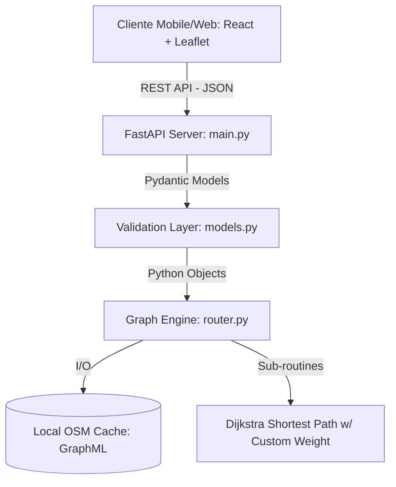
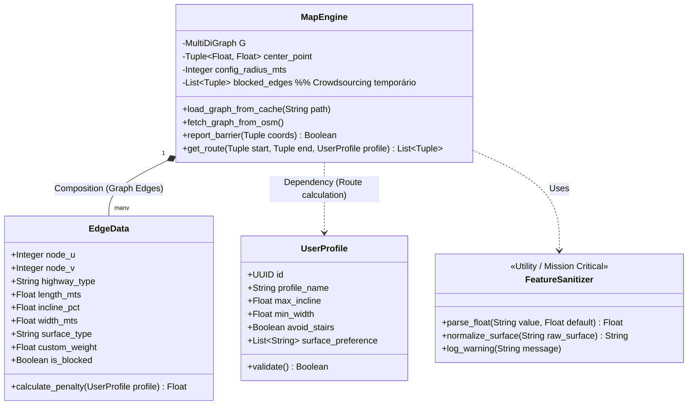
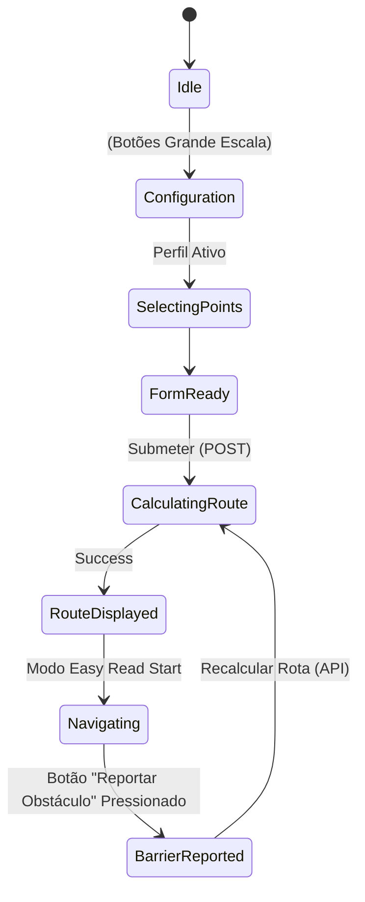

# Especificação de Desenvolvimento de Software (CityFlow Inclusivo)

**Versão:** 1.1 (Atualizada com Features do Mapa Mental e Jornada do Utilizador)
**Fase:** Produto Mínimo Viável (MVP)
**Documento Target:** Equipas de Engenharia de Software (Backend/Frontend)

Este documento define a arquitetura técnica, modelos de dados, diagramas UML, contratos de API e lógica algorítmica necessários para a implementação do MVP do "CityFlow Inclusivo". Abandona-se a perspetiva de "pitch" em favor de rigor de engenharia de software comparável a metodologias lecionadas no Ensino Superior.

---

## 1. Arquitetura de Sistema (System Architecture)

A aplicação segue uma arquitetura Cliente-Servidor Standard com um motor de processamento geoespacial em memória (RAM-based Graph Processing).

### Stack Tecnológica
*   **Frontend (Native/PWA):** React (via Vite) integrado com Leaflet.js (Renderização de Mapas) e empacotado via Capacitor (para exportação mobile nativa).
*   **Backend (API Server):** Python 3.10+ via FastAPI (Asynchronous ASGI).
*   **Core Engine (Routing):** OSMnx, NetworkX e GeoPandas.
*   **Gestão de Dados (Grafos):** Grafo Direcionado (MultiDiGraph) persistido em disco via GraphML (XML format) para caching e grafos temporários (Crowdsourcing).

### Fluxo de Componentes (Component Diagram)


---

## 2. Modelação de Dados (Data Modeling)

O estado persistente é mantido na estrutura da rede viária do OpenStreetMap e nos parâmetros da sessão submetida pelo cliente, com a adição de **Arestas Interditas** para suportar a feature de Crowdsourcing ("Barreira na Via").

### Diagrama de Classes (Backend Engine)


### Modelo de Dados da Aresta (Edge Attributes Data Dictionary)
Cada rua (aresta) no grafo em memória mapeia as tags do OSM:
*   `osmid` (List/Int): ID único no OpenStreetMap.
*   `highway` (String): Classificação da via (ex: `footway`, `steps`, `residential`).
*   `length` (Float): Comprimento em metros (Constante Matemática).
*   `incline` (String -> Float): Percentagem de inclinação original ("5%", "-2%", "up").
*   `surface` (String): Tipo de piso (`paved`, `cobblestone`, `gravel`).
*   `is_blocked` (Boolean): Flag dinâmica injetada quando um utilizador reporta uma Barreira em tempo real.

---

## 3. Contratos de API (RESTful Endpoints)

O comunicação processa-se em JSON via HTTP. O sistema é stateless entre chamadas de rota.

### 3.1. `POST /api/v1/route`
**Objetivo:** Obter as coordenadas de uma rota baseada nos condicionalismos do utilizador.

**Request Body (JSON):**
```json
{
  "start_coords": [41.2954, -7.7451], 
  "end_coords": [41.2982, -7.7420],
  "profile": {
    "profile_name": "wheelchair",
    "max_incline": 0.08,
    "min_width": 1.2,
    "avoid_stairs": true,
    "surface_preference": ["paved", "asphalt", "concrete"]
  }
}
```

**Response (200 OK):**
Array de coordenadas descrevendo a Linha de navegação e as *Instruções Multimodais*.
```json
{
  "status": "success",
  "route_geometry": [
    [41.2954, -7.7451], 
    [41.2956, -7.7450]
  ],
  "metrics": {
    "total_distance_mts": 1250.5,
    "estimated_cost_penalty": 3400.1
  },
  "visual_justification": [
    {
      "reason": "Escadas detetadas",
      "geometry": [[41.2955, -7.7450], [41.2958, -7.7448]]
    }
  ],
  "turn_by_turn": [
    {"type": "right", "message": "Virar à direita na passadeira", "coords": [41.2956, -7.7450]}
  ]
}
```

### 3.2. `POST /api/v1/report-barrier` (Integração da Jornada do Utilizador)
**Objetivo:** Funcionalidade de "Crowdsourcing Dinâmico" para reportar obras ou carros estacionados indevidamente. O Backend encontra a aresta mais próxima das coordenadas e assinala `is_blocked = True`, forçando o router a redesenhar caminhos alternativos.

**Request Body:**
```json
{
  "coords": [41.2960, -7.7445],
  "issue_type": "vehicle_blocking"
}
```

---

## 4. Engenharia do Motor de Pesos (Heurística de Penalização)

A função custo (W) do algoritmo de Dijkstra é gerada pelo cruzamento do comprimento da via com as restrições arquiteturais.

$$ W_e = Comprimento_e \times (\prod_{i=1}^{n} Penalidade_i) $$

**Lógica Condicional (Features da Jornada do Utilizador - Declive e Calçada Irregular):**
```python
penalidade_total = 1.0

# 0. Crowdsourcing (Interrupção Desconhecida)
se data['is_blocked'] == True:
    penalidade_total = 99999.0 # Caminho cortado

# 1. Barreiras Físicas Intransponíveis (Ex: Cadeiras de Rodas)
se data['highway'] == 'steps' e profile.avoid_stairs:
    penalidade_total = 10000.0  

# 2. Pavimento Irregular (Risco de Instabilidade da Ajuda Técnica)
se data['surface'] preenchido e data['surface'] não contido em profile.surface_preference:
    penalidade_total = penalidade_total * 3.5

# 3. Exaustão Física (Declive Elevado)
inclinacao = sanitizar_para_float(data['incline'])
se valor_absoluto(inclinacao) > profile.max_incline:
    penalidade_total = penalidade_total * 15.0

atribuir(W_e = data['length'] * penalidade_total)
```

---

## 5. Arquitetura de Estados e UI no Frontend (Foco IPC e Acessibilidade)

Sendo a UC focada na Interação Pessoa-Computador, a UI/UX da App Web dita o sucesso do MVP. Os requisitos do Mapa Mental exigem que o Frontend aplique soluções de baixa carga cognitiva.

### State Machine de Navegação Inclusiva (Redux/Context)



### Funcionalidades Específicas de Interface (MVP Web App Equivalents)

Como documentado na Jornada do Utilizador, a Web App tem de fornecer soluções de software para limitações sensoriais e cognitivas:

1.  **Modo "Easy Read" (Carga Cognitiva Reduzida):** 
    *   *Especificação Técnica:* Renderização condicional no React. Ao invés de um mapa tradicional cheio de ruas irrelevantes (elevada carga visual), o Frontend esconde o tile layer base quando o utilizador tem limitações cognitivas selecionadas, apresentando *apenas* a linha grossa da rota e ícones universais W3C para virar à esquerda/direita sobre um fundo de alto contraste.
2.  **Feedback Multimodal Web (APIs Nativas do Browser):** 
    *   *Web Speech API:* Para Text-to-Speech (TTS) nativo. A App lê as instruções (ex: `window.speechSynthesis.speak()`) quando atinge um nó (coordenada de curva).
    *   *Vibration API:* Feedback háptico (ex: `navigator.vibrate(200)`) em cruzamentos complexos para utilizadores com limitação visual, servindo como "Alertas Hápticos" documentados.
3.  **Botão de Ação de Grande Escala (Crowdsourcing):**
    *   *Especificação Técnica:* O botão crítico "Reportar Obstáculo na Via" deve ocupar no mínimo 44x44 CSS pixels (Touch Target Size W3C), fixo no rodapé (Z-index elevado), utilizando o input de GPS do próprio browser `navigator.geolocation` para comunicar a obstrução instantânea à API.
4.  **Integração Contraste Dinâmico:** Variáveis de CSS globais (`:root`) ligadas a um Toggle JSX de "Modo de Alto Contraste", trocando a paleta do Leaflet Maps de um basemap claro para um escuro (ex: CartoDB Dark Matter).
5.  **Toggle de Justificação Visual (Transparência do Algoritmo):** Uma opção/camada na interface para mostrar ou esconder as "Rotas Rejeitadas" (linhas vermelhas tracejadas reportadas pela API). Evita a sobrecarga de *Carga Cognitiva* permanente no mapa, mantendo a educação e confiança no sistema.
