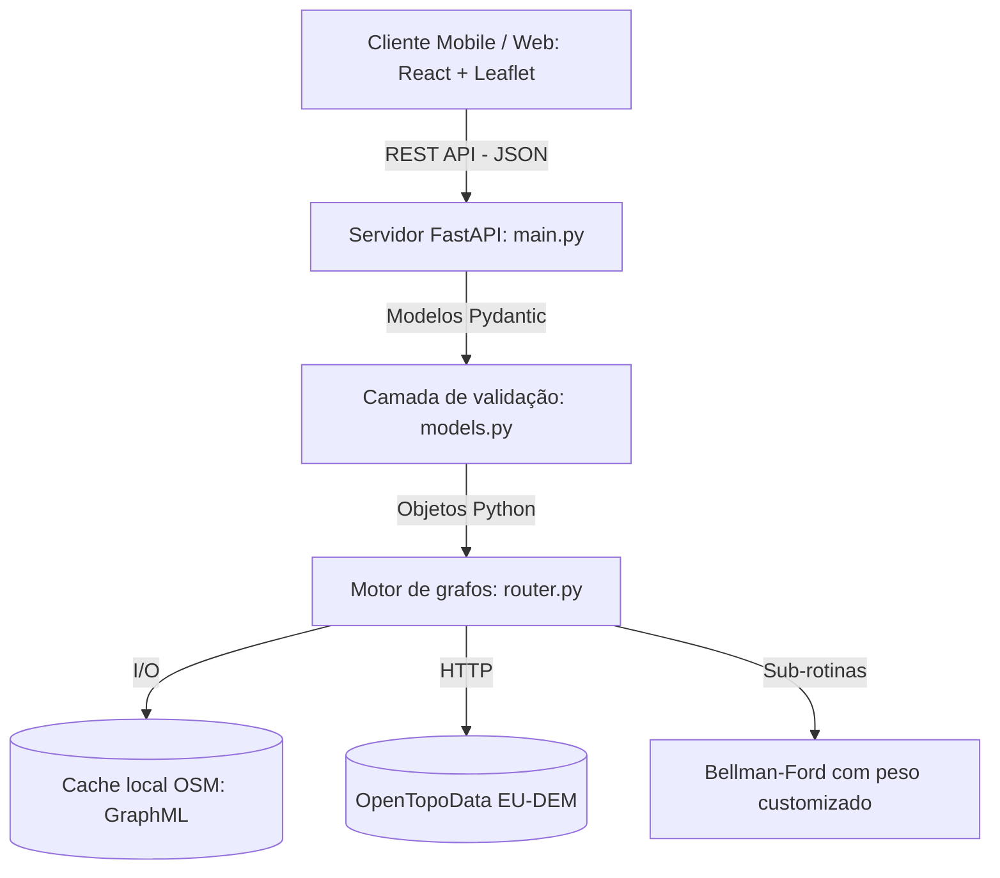
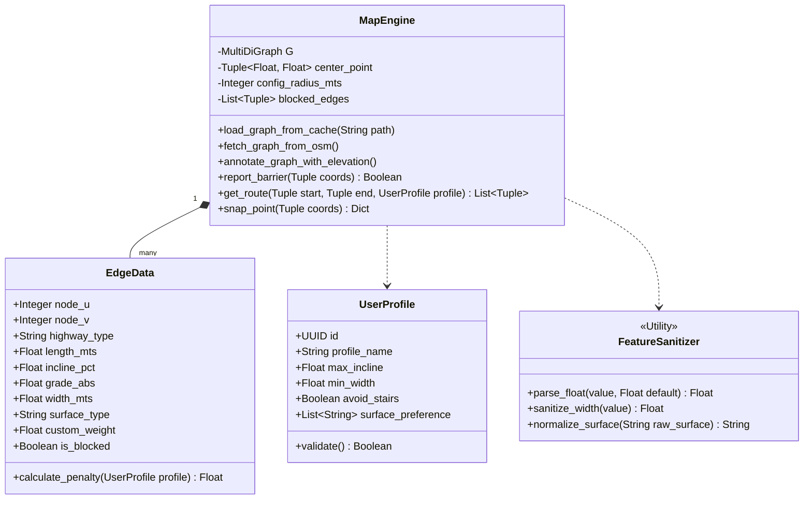
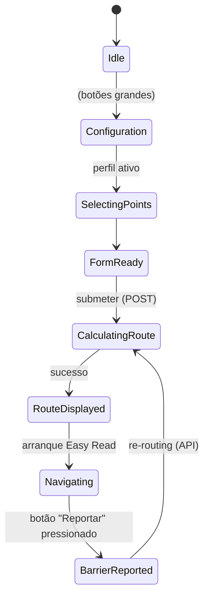

# Especificação de Desenvolvimento de Software (CityFlow Inclusivo)

**Versão:** 1.3 (*routing* multi-cidade — Vila Real + Paris)
**Fase:** Mínimo Produto Viável (MVP)
**Público-alvo:** Equipas de Engenharia de Software (backend / frontend)

Este documento define a arquitetura técnica, modelos de dados, diagramas UML, contratos de API e lógica algorítmica necessários para implementar o MVP do CityFlow Inclusivo. O motor passou a suportar mais do que uma cidade em simultâneo — ver `Multi_City_Viability_Report.md` para a justificação por dados da escolha das cidades suportadas.

---

## 1. Arquitetura do sistema

Uma arquitetura cliente-servidor padrão com motor geoespacial em memória (*RAM-based graph processing*).

### Stack tecnológico
*   **Frontend (PWA):** React (Vite) integrado com Leaflet.js (renderização de mapas).
*   **Backend (servidor API):** Python 3.10+ via FastAPI (ASGI assíncrono).
*   **Motor de *routing*:** OSMnx, NetworkX e GeoPandas.
*   **Enriquecimento de elevação:** OpenTopoData (gratuito, sem chave, conjunto EU-DEM 25 m).
*   **Armazenamento de grafos:** *MultiDiGraph* persistido em disco em formato GraphML para cache.

### Fluxo de componentes


---

## 2. Modelação de dados

O estado é mantido na rede viária do OSM e nos parâmetros de sessão submetidos pelo cliente, mais *blocked edges* para suportar a funcionalidade de *crowdsourcing*.

### Diagrama de classes (motor backend)


### Atributos das arestas (dicionário de dados)
Cada aresta em memória carrega as tags OSM mais os campos derivados da elevação:
*   `osmid` (list/int): identificador único do OSM.
*   `highway` (string): classificação da via (`footway`, `steps`, `residential`).
*   `length` (float): comprimento em metros.
*   `incline` (string → float): declive original do OSM ("5%", "-2%", "up").
*   `grade_abs` (float): declive por aresta calculado de `(elev_v − elev_u) / comprimento`, limitado a 0,25 e suavizado em arestas curtas.
*   `surface` (string): tipo de piso.
*   `is_blocked` (boolean): flag dinâmica colocada quando um utilizador reporta um obstáculo.

---

## 3. Contratos da API

JSON sobre HTTP. O sistema é *stateless* entre chamadas.

### 3.1. `POST /api/v1/route`
**Objetivo:** devolver as coordenadas de uma rota sob as restrições do utilizador.

**Corpo do pedido:**
```json
{
  "start_coords": [41.2954, -7.7451],
  "end_coords": [41.2982, -7.7420],
  "city": "vila_real",
  "profile": {
    "profile_name": "wheelchair",
    "max_incline": 0.08,
    "min_width": 1.2,
    "avoid_stairs": true,
    "surface_preference": ["paved", "asphalt", "concrete"]
  }
}
```

O campo `city` é opcional e por defeito é `vila_real`. Valores permitidos: `vila_real`, `paris`. A lista completa também é exposta por `GET /api/v1/cities`.

**Resposta (200 OK):**
```json
{
  "status": "success",
  "route_geometry": [[41.2954, -7.7451], [41.2956, -7.7450]],
  "distance_meters": 1250.5,
  "max_route_incline": 0.071
}
```

### 3.2. `POST /api/v1/snap-point`
**Objetivo:** projetar uma coordenada de clique sobre a rua pedonal mais próxima, até 250 m.

**Corpo do pedido:**
```json
{ "coords": [41.2960, -7.7445], "city": "vila_real" }
```

`city` é opcional e por defeito é `vila_real`.

### 3.3. `GET /api/v1/cities`
**Objetivo:** endpoint de descoberta usado pelo *dropdown* do frontend.

**Resposta:**
```json
{
  "default": "vila_real",
  "cities": [
    { "slug": "vila_real", "display_name": "Vila Real", "center": [41.296, -7.746], "radius_meters": 1500 },
    { "slug": "paris",     "display_name": "Paris",     "center": [48.8584, 2.347], "radius_meters": 1500 }
  ]
}
```

### 3.4. `POST /api/v1/report-barrier` (planeado)
**Objetivo:** endpoint de *crowdsourcing*. O backend encontra a aresta mais próxima das coordenadas e marca `is_blocked = True`, forçando recálculo.

---

## 4. Motor de pesos

A função custo do Bellman-Ford multiplica o comprimento de cada aresta pelas penalizações de acessibilidade:

$$W_e = \text{comprimento}_e \times \prod_{i=1}^{n} \text{penalização}_i$$

**Lógica condicional:**
```python
penalty_total = 1.0

# Crowdsourcing
if data['is_blocked']:
    penalty_total = 99999.0

# Escadas como barreira (cadeira de rodas / carrinho de bebé)
if data['highway'] == 'steps' and profile.avoid_stairs:
    penalty_total *= 10000.0

# Superfície fora das preferidas
if data['surface'] not in profile.surface_preference:
    penalty_total *= 3.5

# Declive (preferimos o gradiente real à tag OSM `incline`)
grade = data['grade_abs'] or osm_incline_fallback(data['incline'])
if grade > profile.max_incline:
    penalty_total *= 15.0
elif grade > profile.max_incline * 0.75:
    penalty_total *= 3.0

# Largura
if data['width'] < profile.min_width:
    penalty_total *= 5.0

W_e = data['length'] * penalty_total
```

---

## 5. Estado e UI no frontend

### State machine de navegação inclusiva


### Funcionalidades MVP de UI
1. **Modo Easy Read (carga cognitiva reduzida):** renderização condicional do React. Em vez de um mapa cheio (alta carga visual), o frontend esconde o tile base quando o utilizador escolhe um perfil de limitação cognitiva, mostrando apenas a *polyline* da rota e ícones W3C de curvas sobre fundo de alto contraste.
2. **Feedback web multimodal:**
    *   *Web Speech API* para TTS nativo — a app lê as instruções (`window.speechSynthesis.speak()`) em cada nó de manobra.
    *   *Vibration API* — feedback háptico (`navigator.vibrate(200)`) em interseções complexas para utilizadores com baixa visão.
3. **Botão grande de ação (*crowdsourcing*):** o botão "Reportar obstáculo" tem pelo menos 44×44 CSS px (W3C touch target), fixo no rodapé (alto z-index) e usa `navigator.geolocation` para reportar a obstrução.
4. **Integração de contraste dinâmico:** variáveis CSS globais (`:root`) ligadas a um *toggle* JSX, que muda o basemap Leaflet de claro para escuro (CartoDB Dark Matter).
5. **Toggle de justificação visual:** uma camada opcional que mostra rotas rejeitadas (linhas tracejadas vermelhas reportadas pela API). Evita carga cognitiva permanente preservando transparência algorítmica.
