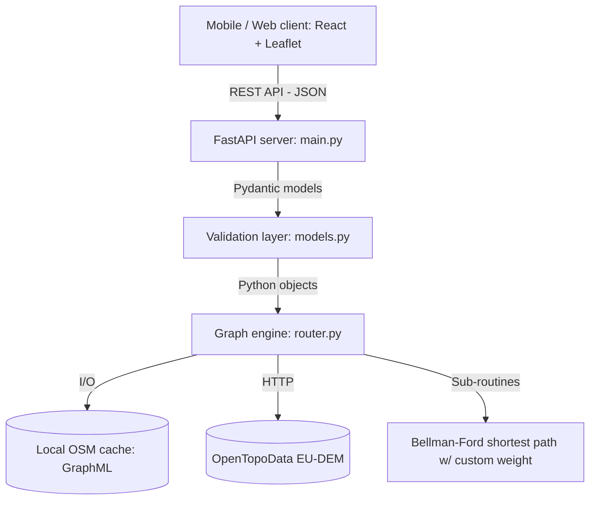
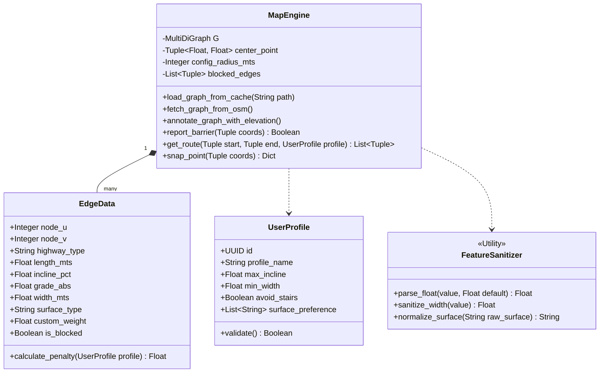
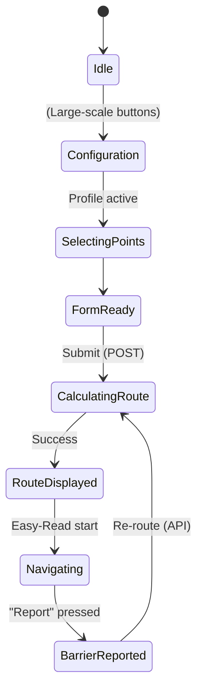

# Software Development Specification (CityFlow Inclusive)

**Version:** 1.3 (multi-city routing — Vila Real + Paris)
**Phase:** Minimum Viable Product (MVP)
**Target audience:** Software engineering teams (backend / frontend)

This document defines the technical architecture, data models, UML diagrams, API contracts and algorithmic logic required to implement the CityFlow Inclusive MVP. The engine now supports more than one city at the same time — see `Multi_City_Viability_Report.md` for the data-driven justification behind the choice of supported cities.

---

## 1. System architecture

A standard client-server architecture with an in-memory geospatial processing engine (RAM-based graph processing).

### Tech stack
*   **Frontend (PWA):** React (via Vite) integrated with Leaflet.js (map rendering).
*   **Backend (API server):** Python 3.10+ via FastAPI (asynchronous ASGI).
*   **Core engine (routing):** OSMnx, NetworkX and GeoPandas.
*   **Elevation enrichment:** OpenTopoData (free, no key, EU-DEM 25 m dataset).
*   **Graph storage:** Multi-directed graph (MultiDiGraph) persisted to disk via GraphML for caching.

### Component flow


---

## 2. Data modelling

State is held in the OSM road network and the session parameters submitted by the client, plus *blocked edges* for the crowdsourcing feature.

### Class diagram (backend engine)


### Edge attributes (data dictionary)
Each edge in memory carries the OSM tags plus the elevation-derived fields:
*   `osmid` (list/int): unique OSM identifier.
*   `highway` (string): road classification (`footway`, `steps`, `residential`).
*   `length` (float): length in metres.
*   `incline` (string → float): original OSM slope ("5%", "-2%", "up").
*   `grade_abs` (float): per-edge slope computed from `(elev_v − elev_u) / length`, capped at 0.25 and smoothed for short edges.
*   `surface` (string): surface type.
*   `is_blocked` (boolean): dynamic flag set when a user reports an obstacle.

---

## 3. API contracts

JSON over HTTP. The system is stateless between calls.

### 3.1. `POST /api/v1/route`
**Goal:** return the coordinates of a route under the user's constraints.

**Request body:**
```json
{
  "start_coords": [41.2954, -7.7451],
  "end_coords": [41.2982, -7.7420],
  "city": "vila_real",
  "profile": {
    "profile_name": "wheelchair",
    "max_incline": 0.08,
    "min_width": 1.2,
    "avoid_stairs": true,
    "surface_preference": ["paved", "asphalt", "concrete"]
  }
}
```

The `city` field is optional and defaults to `vila_real`. Allowed values: `vila_real`, `paris`. The full list is also exposed by `GET /api/v1/cities`.

**Response (200 OK):**
```json
{
  "status": "success",
  "route_geometry": [[41.2954, -7.7451], [41.2956, -7.7450]],
  "distance_meters": 1250.5,
  "max_route_incline": 0.071
}
```

### 3.2. `POST /api/v1/snap-point`
**Goal:** snap a raw click coordinate to the nearest walkable street within 250 m.

**Request body:**
```json
{ "coords": [41.2960, -7.7445], "city": "vila_real" }
```

`city` is optional and defaults to `vila_real`.

### 3.3. `GET /api/v1/cities`
**Goal:** discovery endpoint used by the frontend dropdown.

**Response:**
```json
{
  "default": "vila_real",
  "cities": [
    { "slug": "vila_real", "display_name": "Vila Real", "center": [41.296, -7.746], "radius_meters": 1500 },
    { "slug": "paris",     "display_name": "Paris",     "center": [48.8584, 2.347], "radius_meters": 1500 }
  ]
}
```

**Response (200 OK):**
```json
{
  "status": "success",
  "snapped_coords": [41.29603, -7.74428],
  "distance_meters": 12.4,
  "adjusted": true
}
```
If no walkable edge sits within 250 m, the API replies with 422 and a friendly message.

### 3.3. `POST /api/v1/report-barrier` (planned)
**Goal:** crowdsourcing endpoint. The backend finds the closest edge to the given coordinates and sets `is_blocked = True`, forcing rerouting.

---

## 4. Weighting engine

The Bellman-Ford cost function multiplies each edge's length by the accessibility penalties:

$$W_e = \text{length}_e \times \prod_{i=1}^{n} \text{penalty}_i$$

**Conditional logic:**
```python
penalty_total = 1.0

# Crowdsourcing
if data['is_blocked']:
    penalty_total = 99999.0

# Stairs as a hard barrier (wheelchair / stroller)
if data['highway'] == 'steps' and profile.avoid_stairs:
    penalty_total *= 10000.0

# Non-preferred surface
if data['surface'] not in profile.surface_preference:
    penalty_total *= 3.5

# Slope (real grade preferred over OSM `incline`)
grade = data['grade_abs'] or osm_incline_fallback(data['incline'])
if grade > profile.max_incline:
    penalty_total *= 15.0
elif grade > profile.max_incline * 0.75:
    penalty_total *= 3.0

# Width
if data['width'] < profile.min_width:
    penalty_total *= 5.0

W_e = data['length'] * penalty_total
```

---

## 5. Frontend state and UI

### Inclusive navigation state machine


### MVP-specific UI features
1. **Easy-Read mode (reduced cognitive load):** React conditional rendering. Instead of a busy map (high visual load), the frontend hides the underlying tile layer when the user picked a cognitive-limited profile and only shows the route polyline and W3C left/right turn icons on a high-contrast background.
2. **Multimodal web feedback:**
    *   *Web Speech API* for native TTS — the app reads instructions (`window.speechSynthesis.speak()`) on each turn node.
    *   *Vibration API* — haptic feedback (`navigator.vibrate(200)`) at complex intersections for visually-impaired users.
3. **Large action button (crowdsourcing):** the "Report obstacle" button must be at least 44×44 CSS px (W3C touch target), pinned to the footer (high z-index), using `navigator.geolocation` to report the obstruction.
4. **Dynamic contrast integration:** global CSS variables (`:root`) wired to a JSX toggle, switching the Leaflet basemap from a light base to a dark one (CartoDB Dark Matter).
5. **Visual justification toggle:** an optional layer that toggles rejected routes (dashed red lines reported by the API). Avoids permanent cognitive load while preserving algorithmic transparency.
